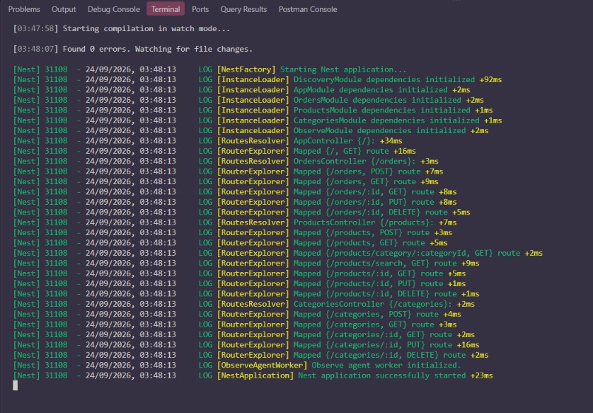
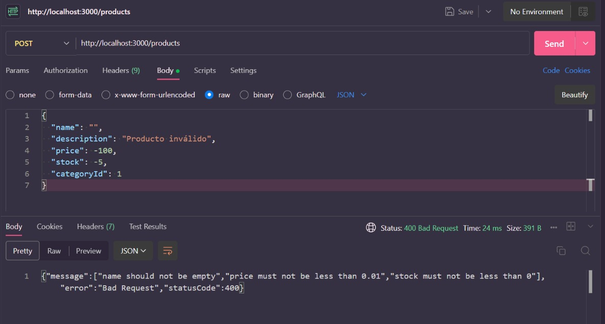
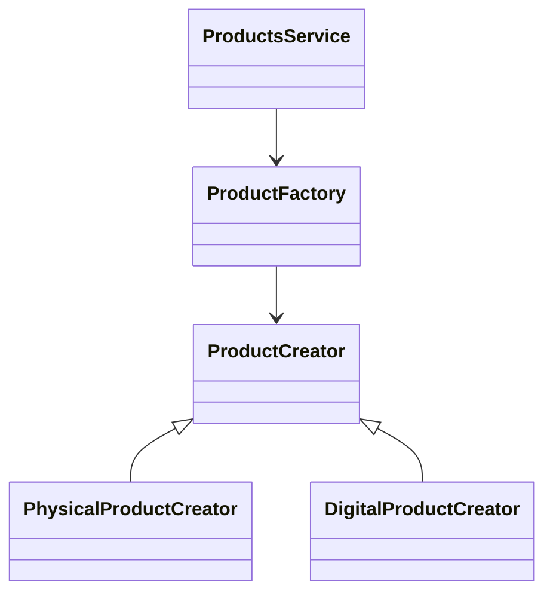
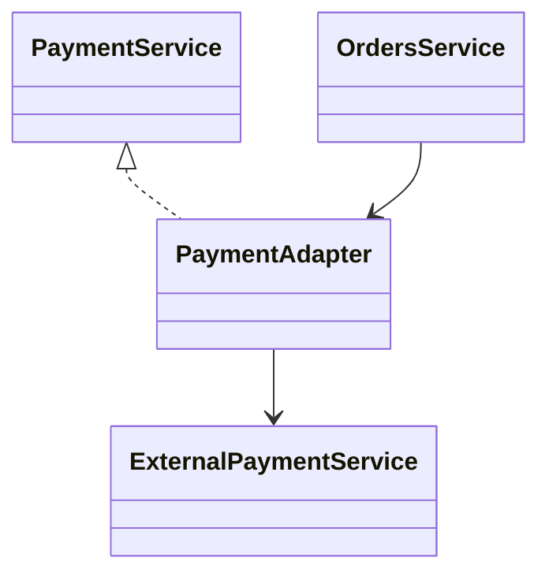
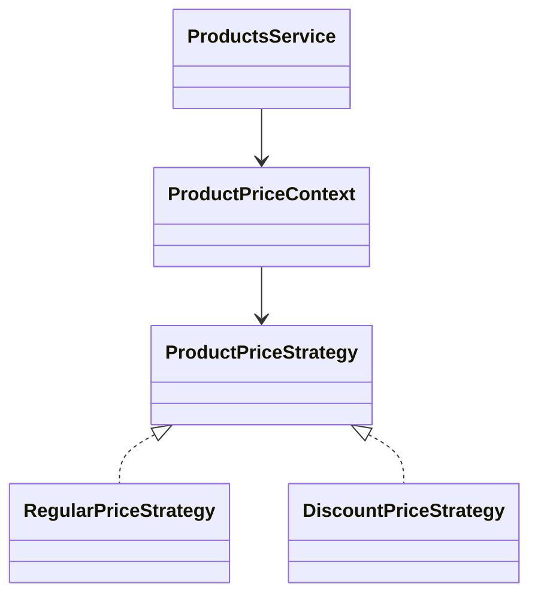
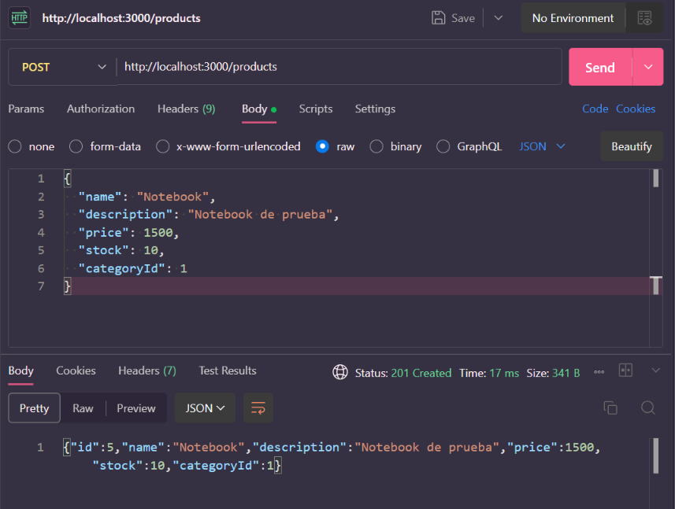
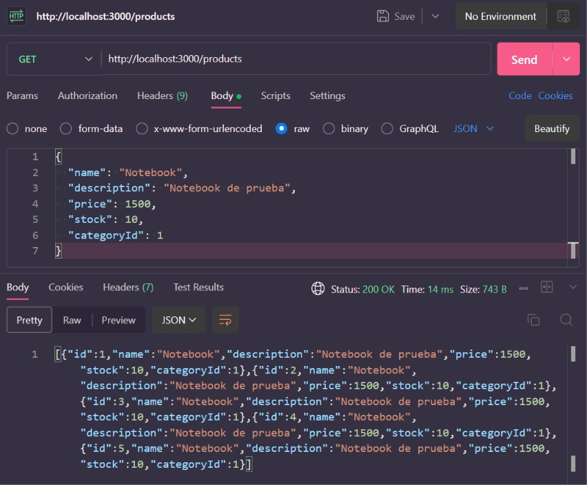
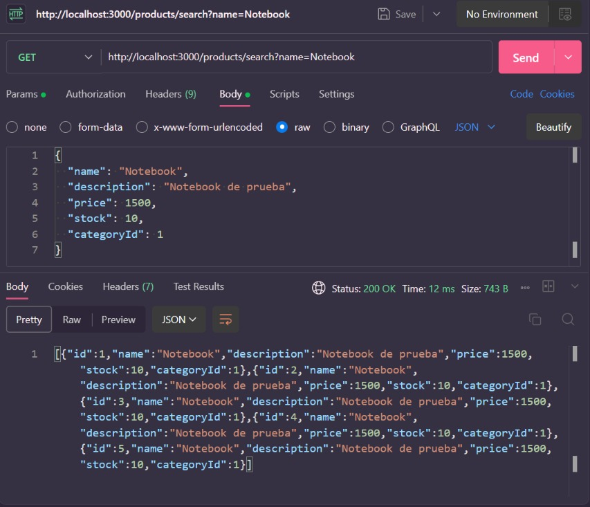
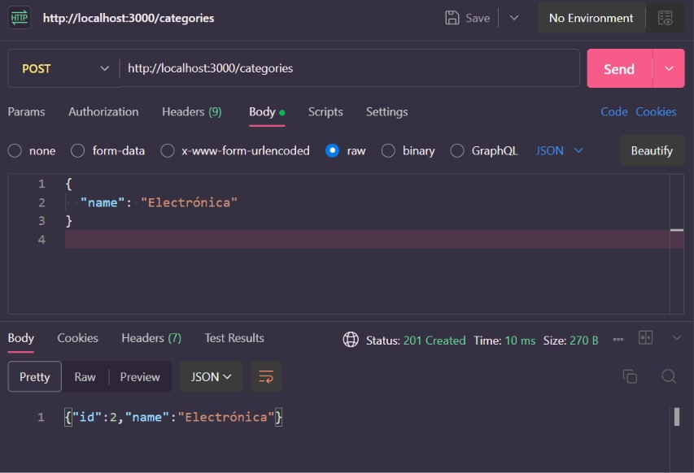
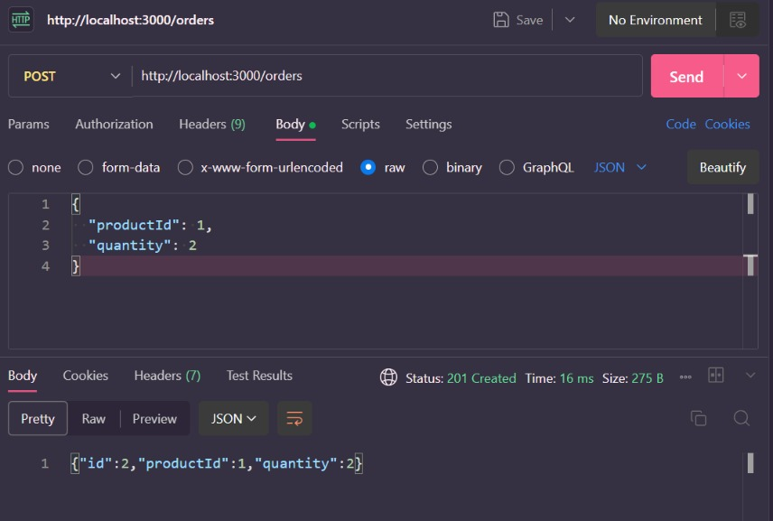

# NestJS + Patrones de Diseño

API REST desarrollada con NestJS y TypeScript para la gestión de productos, categorías y órdenes, aplicando una arquitectura modular y patrones de diseño.

## 📌 Descripción

Este proyecto consiste en el desarrollo de una API REST utilizando **NestJS + TypeScript**, implementando una estructura modular y separando responsabilidades entre controladores, servicios, DTOs y entidades.

La aplicación permite gestionar:

- Productos
- Categorías
- Órdenes

Además, se implementan tres patrones de diseño:

- **Factory Method** — patrón creacional.
- **Adapter** — patrón estructural.
- **Strategy** — patrón de comportamiento.

Los datos se almacenan en memoria mediante arreglos, sin utilizar una base de datos.

---

# 🎯 Objetivo

El objetivo del proyecto es desarrollar una API REST aplicando los conceptos fundamentales de NestJS:

- Módulos.
- Controladores.
- Servicios.
- Inyección de dependencias.
- DTOs.
- Validaciones.
- Parámetros de ruta.
- Parámetros de consulta.
- Manejo de errores.

También se busca integrar correctamente patrones de diseño dentro de la aplicación, justificando su utilización y mostrando su funcionamiento.

---

# 🛠️ Tecnologías utilizadas

- **Node.js**
- **NestJS**
- **TypeScript**
- **class-validator**
- **class-transformer**
- **npm**
- **Git / GitHub**
- **Postman**

---

# 📋 Requisitos

Para ejecutar el proyecto se necesita tener instalado:

- Node.js
- npm
- NestJS CLI

Para comprobar las instalaciones:

```bash
node -v
npm -v
nest -v
```

---

# 🚀 Instalación

Clonar el repositorio:

```bash
git clone https://github.com/Lara78a/tp-nestjs-patrones-diseno.git
```

Ingresar al proyecto:

```bash
cd tp-nestjs-patrones-diseno
```

Instalar las dependencias:

```bash
npm install
```

---

# ▶️ Ejecución

Para ejecutar la aplicación en modo desarrollo:

```bash
npm run start:dev
```

La aplicación queda disponible en:

```text
http://localhost:3000
```

### Aplicación ejecutándose



---

# 📁 Estructura del proyecto

La aplicación se organiza utilizando la estructura modular de NestJS.

```text
src/
├── categories/
│   ├── dto/
│   ├── entities/
│   ├── categories.controller.ts
│   ├── categories.service.ts
│   └── categories.module.ts
│
├── orders/
│   ├── adapters/
│   │   └── payment.adapter.ts
│   ├── dto/
│   ├── entities/
│   ├── orders.controller.ts
│   ├── orders.service.ts
│   └── orders.module.ts
│
├── products/
│   ├── dto/
│   ├── entities/
│   ├── factories/
│   │   └── product.factory.ts
│   ├── strategies/
│   │   └── product-price.strategy.ts
│   ├── products.controller.ts
│   ├── products.service.ts
│   └── products.module.ts
│
├── app.module.ts
└── main.ts
```

La lógica de negocio se encuentra principalmente en los **Services**, mientras que los **Controllers** se encargan de recibir las solicitudes HTTP y delegar las operaciones correspondientes.

---

# 📦 Productos

Los productos contienen los siguientes datos:

```text
id
name
description
price
stock
categoryId
```

## Operaciones disponibles

### Obtener todos los productos

```http
GET /products
```

### Obtener un producto por ID

```http
GET /products/:id
```

### Crear un producto

```http
POST /products
```

Ejemplo:

```json
{
  "name": "Notebook",
  "description": "Notebook de prueba",
  "price": 1500,
  "stock": 10,
  "categoryId": 1
}
```

### Actualizar un producto

```http
PUT /products/:id
```

### Eliminar un producto

```http
DELETE /products/:id
```

---

## 🔎 Búsqueda y filtros de productos

### Buscar por categoría

```http
GET /products/category/:categoryId
```

### Buscar por nombre

```http
GET /products/search?name=Notebook
```

### Filtrar por rango de precio

```http
GET /products?minPrice=1000&maxPrice=2000
```

---

# 🗂️ Categorías

Las categorías contienen:

```text
id
name
```

## Operaciones disponibles

### Obtener todas las categorías

```http
GET /categories
```

### Obtener una categoría

```http
GET /categories/:id
```

### Crear una categoría

```http
POST /categories
```

Ejemplo:

```json
{
  "name": "Electrónica"
}
```

### Actualizar una categoría

```http
PUT /categories/:id
```

### Eliminar una categoría

```http
DELETE /categories/:id
```

---

# 🛒 Órdenes

Las órdenes contienen:

```text
id
productId
quantity
```

## Operaciones disponibles

### Obtener todas las órdenes

```http
GET /orders
```

### Obtener una orden

```http
GET /orders/:id
```

### Crear una orden

```http
POST /orders
```

Ejemplo:

```json
{
  "productId": 1,
  "quantity": 2
}
```

### Actualizar una orden

```http
PUT /orders/:id
```

### Eliminar una orden

```http
DELETE /orders/:id
```

---

# ✅ DTOs y validaciones

La aplicación utiliza DTOs para definir y validar los datos recibidos.

Las validaciones principales para productos son:

- El nombre es obligatorio.
- El precio debe ser mayor a 0.
- El stock debe ser mayor o igual a 0.
- La categoría es obligatoria.

Para las órdenes:

- El producto es obligatorio.
- La cantidad es obligatoria.
- La cantidad debe ser mayor o igual a 1.

La validación se activa globalmente mediante `ValidationPipe` en `main.ts`.

Cuando se envían datos inválidos, la API responde con un código HTTP `400 Bad Request`.

### Ejemplo de validación



---

# 🧩 Patrones de diseño

En el proyecto se implementaron tres patrones de diseño correspondientes a las tres categorías solicitadas.

| Patrón | Tipo | Implementación |
|---|---|---|
| Factory Method | Creacional | Productos |
| Adapter | Estructural | Pagos de órdenes |
| Strategy | Comportamiento | Precio de productos |

---

# 🏭 Factory Method

El patrón **Factory Method** se utiliza para encapsular la creación de productos.

Se encuentra en:

```text
src/products/factories/product.factory.ts
```

Se utilizan:

- `ProductCreator`
- `PhysicalProductCreator`
- `DigitalProductCreator`
- `ProductFactory`

El `ProductsService` utiliza `ProductFactory` para crear los productos en lugar de realizar directamente toda la construcción del objeto.

### Diagrama



### Justificación

El patrón permite separar la lógica de creación de los productos de la lógica principal del servicio.

De esta manera, la creación puede extenderse a diferentes tipos de productos sin concentrar toda la lógica en `ProductsService`.

---

# 🔌 Adapter

El patrón **Adapter** se utiliza para adaptar un servicio externo de pagos a la interfaz utilizada por la aplicación.

Se encuentra en:

```text
src/orders/adapters/payment.adapter.ts
```

Se utilizan:

- `PaymentService`
- `ExternalPaymentService`
- `PaymentAdapter`

El `PaymentAdapter` adapta el método `makePayment()` del servicio externo al método `pay()` definido por la aplicación.

### Diagrama



### Justificación

El Adapter permite que `OrdersService` utilice un servicio de pagos externo sin depender directamente de su interfaz original.

De esta manera se reduce el acoplamiento entre el sistema y el servicio externo.

---

# 🔄 Strategy

El patrón **Strategy** se utiliza para encapsular diferentes formas de calcular el precio de un producto.

Se encuentra en:

```text
src/products/strategies/product-price.strategy.ts
```

Se utilizan:

- `ProductPriceStrategy`
- `RegularPriceStrategy`
- `DiscountPriceStrategy`
- `ProductPriceContext`

### Diagrama



### Justificación

El patrón permite encapsular diferentes algoritmos de cálculo de precio y cambiar la estrategia utilizada sin modificar directamente la lógica del servicio.

Actualmente se encuentra integrada la estrategia de precio regular, mientras que también se implementó una estrategia de descuento.

---

# 💾 Almacenamiento

Para este trabajo se utiliza almacenamiento **en memoria** mediante arreglos.

Por ejemplo:

```ts
private products: Product[] = [];
```

Esto significa que los datos se mantienen mientras la aplicación está ejecutándose y se pierden cuando el servidor se reinicia.

No se utiliza una base de datos en esta implementación.

---

# 🧪 Evidencias de funcionamiento

Las siguientes capturas muestran diferentes operaciones realizadas sobre la API mediante Postman.

## Creación de producto

```http
POST /products
```



---

## Listado de productos

```http
GET /products
```



---

## Búsqueda de productos

```http
GET /products/search?name=Notebook
```



---

## Creación de categoría

```http
POST /categories
```



---

## Creación de orden

```http
POST /orders
```



---

## Validación de datos

Se realizó una prueba enviando datos inválidos al endpoint de productos.

La API responde correctamente con `400 Bad Request`.


---

# 📌 Resumen de endpoints

## Productos

| Método | Endpoint | Descripción |
|---|---|---|
| GET | `/products` | Obtener productos |
| GET | `/products/:id` | Obtener producto por ID |
| POST | `/products` | Crear producto |
| PUT | `/products/:id` | Actualizar producto |
| DELETE | `/products/:id` | Eliminar producto |
| GET | `/products/category/:categoryId` | Filtrar por categoría |
| GET | `/products/search?name=...` | Buscar por nombre |
| GET | `/products?minPrice=...&maxPrice=...` | Filtrar por precio |

## Categorías

| Método | Endpoint | Descripción |
|---|---|---|
| GET | `/categories` | Obtener categorías |
| GET | `/categories/:id` | Obtener categoría por ID |
| POST | `/categories` | Crear categoría |
| PUT | `/categories/:id` | Actualizar categoría |
| DELETE | `/categories/:id` | Eliminar categoría |

## Órdenes

| Método | Endpoint | Descripción |
|---|---|---|
| GET | `/orders` | Obtener órdenes |
| GET | `/orders/:id` | Obtener orden por ID |
| POST | `/orders` | Crear orden |
| PUT | `/orders/:id` | Actualizar orden |
| DELETE | `/orders/:id` | Eliminar orden |

---

# 🧹 Lint y formato

Para ejecutar el análisis de código:

```bash
npm run lint
```

Para formatear el código:

```bash
npm run format
```

---

# 📜 Scripts disponibles

```bash
npm run start
npm run start:dev
npm run start:prod
npm run build
npm run lint
npm run format
```

> Los tests automáticos generados por NestJS se mantienen en el proyecto, pero no se utilizan como evidencia principal de funcionamiento. Las pruebas funcionales presentadas en este README fueron realizadas mediante Postman.

---

# 📊 Resumen de patrones implementados

### Factory Method

**Tipo:** Creacional

Permite encapsular la creación de productos mediante una fábrica y diferentes creadores.

### Adapter

**Tipo:** Estructural

Permite adaptar un servicio externo de pagos a la interfaz utilizada por la aplicación.

### Strategy

**Tipo:** Comportamiento

Permite encapsular diferentes estrategias para el cálculo del precio de los productos.

Los tres patrones se encuentran integrados dentro de la aplicación y son utilizados por los servicios correspondientes.

---

# 📌 Estado del proyecto

La API cuenta con:

- CRUD de productos.
- CRUD de categorías.
- CRUD de órdenes.
- Búsqueda de productos.
- Filtros por categoría.
- Filtros por rango de precio.
- DTOs.
- Validaciones.
- Manejo de errores.
- Factory Method.
- Adapter.
- Strategy.
- Evidencias de funcionamiento mediante Postman.
- Documentación del proyecto.

---

# 👩‍💻 Autores

Iara Fernandez

Lara Magallanes